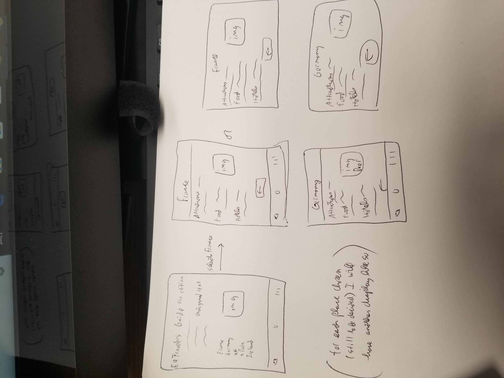

= Project Proposal

== Motivation

I'm going to try and create an app that will help for traveling purposes.  On the homepage of the app you can select from certain locations.  Then after selecting the locations, some good site locations or places to visit will be listed.  The target audience for this app is just people wanting to learn more about places outside of the US or are interested in travel like myself.  Really my motivation behind the app is because im interested in learning more about some of these common travel destinations, as I do plan on one day visiting them.  Something like a rough version of Gogobot will be soemthing I base my app on.  I like the idea of selecting a place and then list some important items like attractions, hotels, and food.    

== Requirements

The UI for my app will be pretty simple.  I will have some different views though forsure.  The homepage will consist of the title of my app and the tourist attractions listed in my small app.  Worth noting, I may focus on a specific contitnent like Europe instead of places all around the world.  Once clicking a location you will be taken to another page with information like attractions and good food to try.  With that being said, I will have back buttons on all of these pages following the homepage so the user can easily go back.  A goal of my app will be to make it very easy to use and follow.  In other words, from the homepage you can access more specific pages about the places listed.  I will store some of the more important information about each place, so it will always be present clicking on the option. 

== MVC Layout

On the homepage of my app, some buttons will be present to allow the user to pick a place and learn some information about them.  Besides that the hopepage wont have much on it.  When they do click on a place to view, they will see some information like listed in the diagrams.  On this page the user will have a back button, and I will most likely try and a little navigation bar to easily get the user back to the homepage.  I will ideally have both a landscape and portrait mode.  For these pages, I believe I will try and incorporant constraint layouts, as I want the pages to look clean and have the information/buttons in the right places.  Im thinking about incorporating a database to store some of this information about the places involved.  Most likely would be SQlite.  So far some pages include database/places.kt, mainactivity.kt, places.kt like france.kt.  Each will have its xml file with it aswell.

